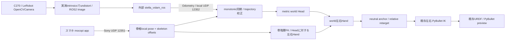

# mocopi + C270 → Dual Scorpion 両腕追従プロトタイプ

Sony mocopiのHeadと左右Handの**骨格推定pose**を、Headに固定したUSBカメラの
visual SLAMと組み合わせ、既存Dual Scorpion IK/URDFで左右腕を追従させます。
実機モータは接続しません。標準出力先は既存PyBulletの**関節姿勢プレビュー**です。
重力、接触、実機servo dynamicsを再現するphysics controllerではありません。

## 現在の到達範囲

- hardwareなしのfake入力 → trajectory校正 → world hands → relative retarget →
  **既存の左右IK → 両腕PyBullet追従**は自動テストとCLIで検証済み。
- Sony UDP receiver、LeRobot C270 capture adapter、checkerboard校正、
  外部stella_vslam ROS2とのImage/Odometry/TF adapterを実装。
- このPCで `/dev/video0` のUSB webcamを検出（640×480、30 FPS）、
  640×480のBGR画像取得も確認。`/dev/video1` はcaptureとして開けないデバイス。
  名称だけではC270型番は確定しない。
- 実機mocopiのpacket capture、実測checkerboard、Head取り付け、
  **外部stella_vslamのビルド・ライブSLAMと融合の実機精度は未検証**。
  ROS2 Jazzy/Kiltedは存在するがstella_vslam_rosは未導入。
- fallbackは明示的 `--mocopi-only`。カメラ・SLAMの補正は使いません。
  実機腕、wrist cameras、gripper encoderは次段階です。

## 構成



ROS2は独立processのadapter。core math、受信、校正、retarget、IKはROS2非依存。
SLAMライブラリ・語彙ファイルは本repositoryへコピーしません。
調査と式の詳細は [MOCOPI_DESIGN.md](docs/MOCOPI_DESIGN.md)。

## 必要な機器とソフトウェア

- Sony mocopi一式、スマートフォンのmocopiアプリ。PC Basicは不要。
- C270一台、Head bandへしっかり固定するmount、USB cable。
- PCとスマホが同じLAN（Sony推奨は5 GHz Wi-Fi）。
- checkerboard。既定値は**横9×縦6の内角**、1マス25 mm。
  印刷されたsquareの実寸を測る。9×6マスという意味ではありません。
- Linux、Python 3.12、uv、PyBullet、NumPy、SciPy、PyYAML、LeRobot/OpenCV。
- カメラ付き融合にはROS2 Jazzy（Python 3.12）、外部stella_vslam>=0.3とROS2 wrapper。
- GUIで腕を見る場合はX11/desktop。displayなしではDIRECTへfallback。

## インストール

以下は全てrepository rootで実行します。以後の各terminalでも最初の4行を実行してください。
`uv run --no-sync` は追加したTelegripをrootのlock同期で削除しないためです。

```bash
cd /home/syun/open_pj/dual_scorpion
export PATH="$HOME/.local/bin:$PATH"
export VIRTUAL_ENV="$PWD/.venv"
export PYTHONPATH="$PWD/telegrip_teleoperation${PYTHONPATH:+:$PYTHONPATH}"

# uvがなければ最初に実行
# curl -LsSf https://astral.sh/uv/install.sh | sh

uv sync --locked
uv pip install --python .venv/bin/python -e ./telegrip_teleoperation pytest
uv run --no-sync --active python -m telegrip.mocopi doctor
uv run --no-sync --active python -m telegrip.mocopi run --fake --sim
```

`Ctrl+C`で終了。最初にhardwareなしで両腕が動くことを確認してください。
`mocopi-track` entry pointも追加しました（上のeditable install後に使用可）。
`--hardware` は起動前に拒否します。serial portやmotor torqueへアクセスしません。

任意のvideo mode一覧表示用:

```bash
sudo apt-get install v4l-utils
uv run --no-sync --active python -m telegrip.mocopi camera-list
v4l2-ctl -d /dev/video0 --list-formats-ext
```

## mocopiアプリの設定と接続確認

2026-07-14更新の[Sony公式送信手順](https://xyn.sony.net/en/developer/technical/mocopi/senddata)に従います。
UDP初期値は12351、IPv4です。[公式技術仕様](https://xyn.sony.net/en/developer/technical/mocopi/techspec)。

1. PCで `hostname -I` を実行し、スマホから到達できるLAN IPv4を確認する。
2. mocopi appを起動、sensorsを接続、アプリ内のcalibrationを完了する。
3. 画面上部の **Motion** を選び、**SAVE → SEND**へ切り替える。
4. Network settings/PC connectionでPCのLAN IPv4、port **12351**、
   transmission format **mocopi (UDP)** を設定する。`localhost`やIPv6は使わない。
5. 下記receiverを**先に**起動する。
6. アプリの **Capture** で送信開始。

```bash
hostname -I
uv run --no-sync --active python -m telegrip.mocopi mocopi-check --duration 30
```

terminalにHead(10)、上腕(12/16)、前腕(13/17)、l_hand(14)、r_hand(18)のxyz(m)と受信FPSが出ます。
これらはraw IMU sensor位置ではなくSony body modelのbone poseです。
27骨のlocal quaternionを受信し、torso/shoulder/upper/lower armを含む階層FKを計算します。
非root位置は公式Unity receiverと同様、最初のskeleton definition offsetを使用します。

`Waiting for skdf` の場合、appのSENDを停止し、receiverを起動した状態でCaptureを再開してください。
骨長をハードコードして受信前の空白を埋める処理はありません。
同じportをcheckとcalibrate/runで同時に使えません。check終了後に次へ進みます。
UDP packetはSony仕様により暗号化されません。LANで使用してください。

## ANKLEを二の腕へ付ける「上半身集中」モード

今回の両腕追従ではこの装着を既定の案内にしています。
Sony公式の[上半身集中モード](https://www.sony.co.jp/en/Products/mocopi-dev/jp/documents/beta/HowToBetaFunctions_UpBody.html)
はANKLEを二の腕へ移して上半身のtrackingを重点化する機能です。
公式ページではベータ機能として説明されています。スマホアプリの対応版を使ってください。

| センサー | 装着先 |
|---|---|
| HEAD | 頭。C270も同じHead bandへ固定 |
| WRIST/L、WRIST/R | 左右の手首 |
| ANKLE/L、ANKLE/R | 左右の二の腕（UPPER ARM） |
| HIP | 腰 |

二の腕の正確な位置・向きはスマホアプリの装着案内に合わせます。
二頭筋の収縮や筋電位を測る方式ではなく、上腕の動きを捉えるIMUとして使用します。
既存のankle bandの長さが足りない場合は、公式案内に従い延長bandを用意してください。

1. スマホの「センサーの接続」画面の右上 **︙ → 高度な機能の有効化**。
2. 「トラッキングモードの選択」で **上半身集中**を選ぶ。
3. アプリの指示に従いANKLE/L・Rを左右上腕へ移し、他の4個も装着。
4. **この装着・モードでアプリ側のcalibrationをやり直す**。
5. PCの `mount-check` で装着案内を確認し、receiver起動後にSENDする。

```bash
uv run --no-sync --active python -m telegrip.mocopi mount-check
uv run --no-sync --active python -m telegrip.mocopi mocopi-check --duration 30
```

YAMLの `mocopi.tracking_mode: upper_body` は装着案内用の**運用者による宣言**です。
この設定だけではスマホのモードは変わらず、UDPから装着位置を自動判定しません。
足首に戻して標準モードを使う場合は `tracking_mode: standard` とし、アプリ側も戻します。
装着モード変更後はアプリ校正とHead-SLAM校正・neutral anchorを取り直してください。

受信するのはアプリが推定した骨格です。既存FKは上腕・前腕の回転をHand poseへ反映するので、
上腕の追加情報による推定改善を同じHand追従経路で利用できます（改善量の実測は未実施）。
**センサーのANKLEという名前とUDPの足のboneは別物**です。
足のboneを腕へ読み替えたり、ankleのposeを上腕へ直接入力する処理は加えていません。
上半身集中の実UDP互換性は実機で確認する必要があります。

`mocopi-check` はHead、左上腕(12)/前腕(13)/Hand(14)、右上腕(16)/前腕(17)/Hand(18)を表示。
`run` はworld肩・肘のxyzも表示し、ROS bridge経由で
`/mocopi/left_shoulder`、`/mocopi/left_elbow`、`/mocopi/right_shoulder`、`/mocopi/right_elbow`
のPoseStamped/TFを出します。これらはvirtual bone originで、sensor中心ではありません。
古いminimal replayには肩・肘がなくてもHand追従は動きます。

現在のrobot IKはHand/TCP目標を追う方式です。人間の肘位置・上腕方向をrobotの
冗長7軸姿勢へ直接一致させるconstraintは未実装です。その拡張に備えて肩・肘を確認できます。

## C270確認とintrinsic calibration

```bash
uv run --no-sync --active python -m telegrip.mocopi camera-list
uv run --no-sync --active python -m telegrip.mocopi doctor
```

`config/mocopi/tracking.yaml` の `camera.device` は `/dev/video0` が既定。
`camera-capture`、`doctor`、ROS2 bridgeに `--camera /dev/video2` を渡すと、
そのコマンドだけ使用するカメラを変更できます。`--camera 0` の数値index、
`/dev/v4l/by-id/...` の安定pathも指定可能です。`doctor --camera /dev/video2` の
`selected_camera`で選択した設定を確認できます（接続検証は撮影時に行います）。
常に同じカメラを使う場合はYAMLの `camera.device` を変更してください。
resolution/FPS/fourccは同じcamera節へ保存します。
別のカメラへ変更したら、そのカメラでintrinsic calibrationとHead-camera calibrationを行ってください。
撮影とROS2 bridgeには同じ `--camera` を指定します。追従の `run` はbridgeから姿勢を受信するため、
カメラの指定はbridge側で行います。

checkerboardを用意し、撮影開始のEnterを押します。
2秒ごとに20枚撮影。中央だけでなく四隅、斜め、距離の変化を含めます。
headless OpenCVでも動く保存画像方式で、`imshow`は不要です。

```bash
uv run --no-sync --active python -m telegrip.mocopi camera-capture \
  --camera /dev/video0 --output outputs/mocopi/checkerboard --count 20 --interval 2
uv run --no-sync --active python -m telegrip.mocopi calibrate-camera \
  --images outputs/mocopi/checkerboard --board 9 6 --square-m 0.025
cat config/mocopi/calibration/c270_intrinsics.yaml
cat config/mocopi/calibration/c270_stella.yaml
```

出力はfx/fy/cx/cy/distortion/resolution/reprojection RMS。
検出画像12枚未満、画面内の移動不足、RMS>1.5 pixelは拒否して保存しません。
SLAM bridgeはこのKとdistortionでundistortし、stella設定へ同じKと**歪み0**を渡します。
画像の解像度と校正値が異なる場合は起動しません。仮のintrinsicsは同梱しません。

## 外部stella_vslamの準備

採用理由: BSD-2、Linux、単眼perspective、map保存、ROS2 wrapper、
UVCを既存Image topic経由で接続できること。ORB-SLAM3はGPLv3、公式examplesはROS1で、
C270にはIMUがないためvisual-inertialの利点を使えません。
両方式とも低texture、急な回転、blurに弱く、ライセンスだけで性能の優劣は決めていません。
[stella公式source](https://github.com/stella-cv/stella_vslam)、
[ORB-SLAM3公式source](https://github.com/UZ-SLAMLab/ORB_SLAM3)。

stella<0.3はライセンス上の扱いが異なるため対象外。
外部依存のビルドはこのPCで未実施。ネイティブ導入は
[公式ROS2手順](https://stella-cv.readthedocs.io/en/latest/ros2_package.html)と
[公式installation](https://stella-cv.readthedocs.io/en/latest/installation.html)を参照。
ROS2 wrapperの確認済みcommitは `186f623dd1c24ee83678f8e1da593801f450bbb3`。
公式Dockerfile.cuiを使う場合の具体例（Linux、Docker、network接続が必要）:

```bash
mkdir -p "$HOME/.cache/dual-scorpion-slam"
git clone --recursive --branch ros2 https://github.com/stella-cv/stella_vslam_ros.git \
  "$HOME/.cache/dual-scorpion-slam/stella_vslam_ros"
git -C "$HOME/.cache/dual-scorpion-slam/stella_vslam_ros" checkout \
  186f623dd1c24ee83678f8e1da593801f450bbb3
git -C "$HOME/.cache/dual-scorpion-slam/stella_vslam_ros" submodule update --init --recursive
uv run --no-sync --active python -m telegrip.mocopi.prepare_stella \
  "$HOME/.cache/dual-scorpion-slam/stella_vslam_ros"
docker build -f "$HOME/.cache/dual-scorpion-slam/stella_vslam_ros/Dockerfile.cui" \
  -t dual-scorpion-stella "$HOME/.cache/dual-scorpion-slam/stella_vslam_ros"
mkdir -p outputs/mocopi
curl -fL https://github.com/stella-cv/FBoW_orb_vocab/raw/main/orb_vocab.fbow \
  -o outputs/mocopi/orb_vocab.fbow
```

公式DockerfileはHumble、hostのbridgeはJazzy/Python3.12。
Linux `--network host` でROS Image/Odometry通信する構成です。
ビルド中は上流の依存をネットから取得するので、環境により上流ビルド修正が必要です。
完全再現可能なSLAM配布imageを本変更で保証するものではありません。
DDSのdomainを揃え、`ROS_LOCALHOST_ONLY=1` を両processに設定します。

**Tracking guardは必須です。** 上流のtracking_moduleはLost時も予測poseを返す場合があり、
未変更wrapperはpose pointerだけでpublishを判定します。上記prepare_stellaは外部checkoutの
publish_poseへ `get_tracking_state() == "Tracking"` 条件を追加します。
不明なsource構造なら変更せず拒否。ネイティブ導入もclone後・build前に同じ処理を実行し、
導入済みの場合は次を実行して再buildしてください。

```bash
uv run --no-sync --active python -m telegrip.mocopi.prepare_stella \
  "$HOME/ros2_ws/src/stella_vslam_ros"
source /opt/ros/jazzy/setup.bash
cd "$HOME/ros2_ws"
colcon build --symlink-install --packages-select stella_vslam_ros
cd /home/syun/open_pj/dual_scorpion
```

## ライブ追従: 起動順とEnterの順

まずcamera intrinsic calibrationを完了してください。
C270をHead bandに固定、mocopiをHeadと左右手を含むアプリ指定の位置へ装着します。
まだrobot USB controllerは接続不要です。

**Terminal A: Head camera bridge**

```bash
cd /home/syun/open_pj/dual_scorpion
export PATH="$HOME/.local/bin:$PATH"
export VIRTUAL_ENV="$PWD/.venv"
export PYTHONPATH="$PWD/telegrip_teleoperation${PYTHONPATH:+:$PYTHONPATH}"
source /opt/ros/jazzy/setup.bash
export ROS_DOMAIN_ID=42
export ROS_LOCALHOST_ONLY=1
uv run --no-sync --active python -m telegrip.mocopi.ros_bridge \
  --config config/mocopi/tracking.yaml --camera /dev/video0 --map-id head-map-001
```

C270が開かれ、実測intrinsicsを読み込み、`/camera/image_raw`へ歪み補正済みBGR画像をpublish。
失敗時はdevice pathと利用できるcameraのresolution/FPSを表示。

**Terminal B: external SLAM**（上記Dockerをビルド済みの場合）

```bash
cd /home/syun/open_pj/dual_scorpion
export ROS_DOMAIN_ID=42
export ROS_LOCALHOST_ONLY=1
docker run --rm -it --network host \
  -e ROS_DOMAIN_ID=42 -e ROS_LOCALHOST_ONLY=1 \
  -v "$PWD:/data" dual-scorpion-stella \
  ros2 run stella_vslam_ros run_slam \
  -v /data/outputs/mocopi/orb_vocab.fbow \
  -c /data/config/mocopi/calibration/c270_stella.yaml \
  --map-db-out /data/outputs/mocopi/head-map-001.msg \
  --ros-args -p publish_tf:=false -p encoding:=bgr8
```

ネイティブ版を既に導入済みの場合は同等のコマンド:

```bash
source /opt/ros/jazzy/setup.bash
source "$HOME/ros2_ws/install/setup.bash"
export ROS_DOMAIN_ID=42
export ROS_LOCALHOST_ONLY=1
ros2 run stella_vslam_ros run_slam \
  -v outputs/mocopi/orb_vocab.fbow \
  -c config/mocopi/calibration/c270_stella.yaml \
  --map-db-out outputs/mocopi/head-map-001.msg \
  --ros-args -p publish_tf:=false -p encoding:=bgr8
```

静止・純回転だけでは単眼初期化しません。模様のある壁/机を映し、頭を左右へゆっくり平行移動。
Terminal Aの `SLAM=OK` を確認します。

**Terminal C: Head-SLAM calibration**

```bash
cd /home/syun/open_pj/dual_scorpion
export PATH="$HOME/.local/bin:$PATH"
export VIRTUAL_ENV="$PWD/.venv"
export PYTHONPATH="$PWD/telegrip_teleoperation${PYTHONPATH:+:$PYTHONPATH}"
uv run --no-sync --active python -m telegrip.mocopi calibrate-head
```

このreceiverを起動してから、スマホの**SEND/Captureを停止→再開**します。
Head/左右HandとSLAMの同期が取れると、順に以下が表示されます。

1. Head sensor + C270を固定したことを確認し **Enter**。
2. 左手側sensorを確認し **Enter**。
3. 右手側sensorを確認し **Enter**。
4. 左二の腕のANKLE/Lを確認し **Enter**（standardなら左足首）。
5. 右二の腕のANKLE/Rを確認し **Enter**（standardなら右足首）。
6. HIPとスマホ側calibrationを確認し **Enter**。
7. neutral poseで静止し **Enter**。
8. 次の15秒の動作説明を読み、**Enterで記録開始**。
9. 頭を少なくとも8 cm以上上下左右に移動し、yawだけでなくpitch/rollもゆっくり変える。
   カメラがsceneを見失わない範囲で、全身も少し平行移動すると尺度の観測に役立ちます。
10. 15秒後、自動計算。scale、position RMSE、rotation RMSE、extrinsic validが出る。

```bash
cat config/mocopi/calibration/head_tracking.yaml
```

60同期sample以上、RMSE<=0.04m、姿勢RMSE<=8度、Jacobian condition<=100000、
camera-to-head距離<=0.3m等を満たした場合だけ保存します。
観測不足や不整合を成功扱いしません。不良校正は既存ファイルを上書きしません。
これらの閾値を満たすことはmocopi推定の絶対位置精度の保証ではありません。

**Terminal C: 両腕simulation追従**（校正終了後、A/Bは継続）

```bash
uv run --no-sync --active python -m telegrip.mocopi run --sim
```

ここでもreceiverが待機したらスマホのSEND/Captureを停止→再開します。
表示されたneutral poseの案内で静止し、**最後のEnter**を押します。
その時の左右Handと現在robot TCPを別々にanchorします。
左手をゆっくり上げる→left arm、右手を上げる→right armが追従します。
GUIなしなら `--headless` を付けてterminalの関節角を確認します。

terminalはmocopi FPS、SLAM状態、Head/左右Hand xyz、各腕IK status/関節角、
tracking_valid、last_update_ageを1秒ごとに表示。
camera FPSはTerminal Aに表示。
既存visualizerの左右target sphere、actual TCP markerと腕姿勢が更新され、
invalid時のstatus文字は赤になります。Head/Hand trajectoryはROS2で表示可能。

## monocular scale・座標・校正の意味

単眼SLAMのtranslationは未確定尺度です。直接meterとしてIKへ送りません。
15秒の同期Head/Camera軌跡を用いてSim(3)とrigid camera→Head extrinsicを**同時推定**します。
1frame合わせや同一点を仮定したUmeyamaだけにはしません。

```
R_M_H = R_M_S R_S_C R_C_H
p_M_H = s R_M_S p_S_C + t_M_S + R_M_S R_S_C t_C_H
T_W_H = T_M_S * [R_S_C, s*p_S_C] * T_C_H   (W=M)
T_H_L = inverse(T_M_H) * T_M_L
T_H_R = inverse(T_M_H) * T_M_R
T_W_L = T_W_H * T_H_L
T_W_R = T_W_H * T_H_R
```

camera→Head translationはmetricであり、**extrinsic translationにSLAMのscaleをかけません**。
Umeyamaで初期化しSO(3)rotvec/log-scaleのrobust least-squaresを行い、
並進・複数回転軸の励起とJacobianの観測可能性を検査します。
尺度の基準はmocopi人体モデルの推定Head軌跡なので、個人body size設定や漂流の影響を受けます。
Head boneは物理Head sensor中心と厳密には一致せず、ここで得るextrinsicはvirtual boneへの実効値。

Sony nativeは右手系 X-left/Y-up/Z-forward（公式Unity conversionから確認）。
内部M/W/H/Handは右手系X-forward/Y-left/Z-up。meter、4×4 SE(3)、xyzw quaternion。
stella ROS2 outputはROS map/camera basisのT_S_C（既にOpenCVから変換済み）。
そのまま取り込み、calibrationで内部worldへalignします。
人間worldとrobot standはanchorで対応させ、絶対位置はrobotへコピーしません。

retargetはposition差分に `translation_scale`（既定0.8）と
`world_to_robot_rotation` を適用し、robot initial TCPへ加算。
orientation差分には同じbasis変換と `orientation_scale`（0.5）を適用。
`orientation_enabled: false` ならinitial TCP orientationを維持。
人間側左右をswap/mirrorする処理はありません。
既存URDFは左右mount offsetを含み、両bodyのbaseは同じstand原点です。
IK境界はposition(m)、xyzw、関節角(deg)、TCP=link7、7関節。
既存IKのposition優先fallbackにより、orientationを完全一致できない場合があります。

## timestamp・tracking lost・再開

mocopiはPC UDP受信時刻、cameraはsoftware取得時刻を`time.monotonic()`で持ちます。
mocopi validityは完全packetの受信と変換の有効性です。motion packetだけから
個々のsensor接続状態を取得する処理はなく、appが推定骨格の送信を継続する場合に
sensor単体のtracking lossを自動判定することはできません。
ROS bridgeはImage stamp→monotonic時刻の表を保存し、stella Odometryの**元画像stamp**から
時間を復元します。計算終了時刻をcamera timestampにしません。
nearest sampleの最大差は0.08秒、timeoutは0.3秒。制御周期は30 Hz。
C270 exposure/USB queueとmocopi network latencyは実測していません。
`timestamp_offset_s` でmocopiの受信遅延補正を設定できます。
このMVPは複数PCのmonotonic clock同期には対応しません。

SLAM lost、camera disconnect、packet timeout、Head/Hand急変、map/intrinsics不一致で
tracking_valid=false、両腕関節目標をHOLD。NaN/limit違反/jump/IK失敗は該当腕をHOLD。
SLAM lostは必須Tracking guard付きwrapperがpose publishを止めるためtimeoutで検出。

復旧して新しい同期poseが継続して届いた後、追従terminalで**Enter**。
現在Handと最後のrobot姿勢でanchorを取り直して再開します。
自動で古いanchorへ戻って突然大きく動かすことはありません。
head/mapの再初期化、mount変更、mocopi resetの場合はHOLD解除だけで済ませず再校正します。

終了はC→B→Aの順に各terminalで `Ctrl+C`。robot実機には何も送っていません。

## 地図と校正の再利用・再校正

校正はYAMLとして再起動後もロード可能ですが、**同一SLAM map**でのみ有効。
新しいmapを作る際はTerminal Aのmap-idとYAML `slam.map_id` を新しい名前（例head-map-002）にし、
calibrate-headを再実行します。同じIDで別のmapを作らないでください。
map-idは上流が提供しないため運用者が管理します。
既存mapを再利用する場合はSLAMを `--disable-mapping --map-db-in ...` で起動:

```bash
# Terminal B、ネイティブ導入済みの場合
ros2 run stella_vslam_ros run_slam --disable-mapping \
  -v outputs/mocopi/orb_vocab.fbow \
  -c config/mocopi/calibration/c270_stella.yaml \
  --map-db-in outputs/mocopi/head-map-001.msg \
  --ros-args -p publish_tf:=false -p encoding:=bgr8
```

同じmap-id、intrinsics hashが一致し、起動時Headとmocopiの整合性（0.15m/0.35rad）を
満たす必要があります。mocopi world reset後は同じmapでも再校正。
Head mount/解像度変更の場合はintrinsicまたはhead calibrationをやり直してください。
再校正は上記 `calibrate-camera` / `calibrate-head` を同じpathで実行。
失敗時は上書きされませんが、古い校正の有効性が回復したわけではありません。

## fake / record / replay / fallback / tests

```bash
uv run --no-sync --active python -m telegrip.mocopi run \
  --fake --sim --headless --duration 5 --record outputs/mocopi/fake.jsonl
uv run --no-sync --active python -m telegrip.mocopi run \
  --replay outputs/mocopi/fake.jsonl \
  --calibration outputs/mocopi/fake.jsonl.calibration.yaml \
  --sim --headless --duration 5
uv run --no-sync --active python -m pytest tests/teleoperators/test_mocopi_tracking.py -q

# mocopiのみ確認する明示的fallback（C270/SLAM不要）
uv run --no-sync --active python -m telegrip.mocopi run --mocopi-only --sim
```

liveのrunも `--record outputs/mocopi/session.jsonl` を付ければ同期入力を保存します。
対応する校正YAMLも `.jsonl.calibration.yaml` に保存。
replayは記録時刻を新しいPC monotonic epochへrebasingし、終了後はtimeout HOLD。
fakeで実機intrinsics/head calibrationを作りません。
`calibrate-head --fake` の出力先は別ファイル `fake_head_tracking.yaml` です。

## ROS2 topic/TFと可視化

```bash
source /opt/ros/jazzy/setup.bash
export ROS_DOMAIN_ID=42
export ROS_LOCALHOST_ONLY=1
ros2 topic hz /camera/image_raw
ros2 topic echo /run_slam/camera_pose --once
ros2 topic echo /mocopi/left_hand_target --once
ros2 run tf2_ros tf2_echo world left_hand_target
rviz2
```

| topic | type | 用途 |
|---|---|---|
| `/camera/image_raw` | sensor_msgs/Image | 校正済みundistorted BGR |
| `/camera/camera_info` | sensor_msgs/CameraInfo | 同じK、歪み0 |
| `/run_slam/camera_pose` | nav_msgs/Odometry | 外部stellaの**未metric尺度** |
| `/mocopi/mocopi_head` | geometry_msgs/PoseStamped | metric world Head |
| `/mocopi/left_hand_target`, `/mocopi/right_hand_target` | PoseStamped | world Hand |
| `/mocopi/left_shoulder`, `/mocopi/right_shoulder` | PoseStamped | world human shoulder |
| `/mocopi/left_elbow`, `/mocopi/right_elbow` | PoseStamped | world human elbow |
| `/mocopi/left_ee_target`, `/mocopi/right_ee_target` | PoseStamped | robot standのIK target |
| `/mocopi/left_ee_actual`, `/mocopi/right_ee_actual` | PoseStamped | FK確認TCP |
| `/tf` | TFMessage | 下記metric frame tree |

TFは `world → slam_map_metric → head_camera`、`world → mocopi_head/mocopi_root/left_hand_target/right_hand_target`。
肩・肘の骨がある入力ではworldから左右shoulder/elbowへもTFを出します。
robot standは別treeで `robot_stand → left_robot_base/right_robot_base/left_ee_target/right_ee_target/left_ee_actual/right_ee_actual`。
左右baseはURDF共通rootのalias（identity）。肩mount offsetはURDF内。
Sim(3)のscaleはTFに載せられないので、未metricのslam_mapをSE(3)のworld TFと偽ってpublishしません。
RVizはhuman表示にはFixed Frame=world、robot TCP表示にはrobot_stand。
両tree間の一意なrigid transformは人体縮尺のretargetからは決まりません。
TF/Poseはvalid tracking中のみ更新し、lost時は止めます。
trajectoryはRVizのPose表示やROS2 bag記録で確認できます。

## configとファイル

- `config/mocopi/tracking.yaml`: mocopi/camera/slam/tracking/calibration/retarget/robot設定。
  全pathはこのYAMLからの相対path。`--config /absolute/path/custom.yaml` で切替。
- `config/mocopi/calibration/c270_intrinsics.yaml`: 実測K/distortion/resolution。
- `config/mocopi/calibration/c270_stella.yaml`: Kを引き継いだstella設定。
- `config/mocopi/calibration/head_tracking.yaml`: scale、map alignment、camera→Head、品質、map-ID/hash。
- `telegrip_teleoperation/telegrip/mocopi/`: source/core/CLI/ROS adapter。
- `tests/teleoperators/test_mocopi_tracking.py`: hardwareなしで数値・異常処理・既存左右IKを検証。
- `docs/MOCOPI_DESIGN.md`: 実装前のrepository調査、公式source commit、選定・式の根拠。
- 既存 `telegrip/__init__.py` と `core/__init__.py`: optional backendをlazy import化。
  numerical CLIのimport時に実機driverを読み込まないため。
- `telegrip_teleoperation/pyproject.toml`: `mocopi-track` entry point。

## Troubleshooting

| 症状 | 対応 |
|---|---|
| mocopiデータなし | 同LAN、PC IPv4、mocopi(UDP)、12351、SEND/Captureを確認。receiver起動後にSENDを再開 |
| address already in use | mocopi-check/run/calibrateの重複を終了。同portは1receiverのみ |
| Waiting for skdf | receiverを動かしたままapp SENDを停止→再開。骨格定義が必要 |
| cameraなし/busy | camera-listで全device/profileを確認。別capture processを停止。video1はmetadataの可能性 |
| camera permission | `ls -l /dev/video0` / `id` を確認。必要なら `sudo usermod -aG video "$USER"` 後loginし直す |
| Supported modes不明 | `sudo apt-get install v4l-utils` 後camera-list再実行 |
| No module named telegrip | rootでPYTHONPATHを設定、またはeditable installを実行 |
| No module named rclpy | 同terminalで `/opt/ros/jazzy/setup.bash` をsource。Python3.12を使用 |
| stella package not found | 外部stellaのbuild/ROS workspace setupを実行。fake/mocopi-onlyは単独動作可能 |
| SLAM initializing/lost | カメラを模様あるsceneへ向け、平行移動で初期化。露出/照明/blur/USB fpsを確認 |
| ROS topicが届かない | 両processのROS_DOMAIN_ID=42、network host、ROS_LOCALHOST_ONLYを揃える |
| 同期sample不足 | tracking max_pair_dt/timeout、camera FPS、SLAM処理負荷を確認。古いposeを新鮮扱いしない |
| Head校正rejected | 平行移動+2軸以上回転、mountの緩み、mocopi reset、timestamp latency、body設定を確認 |
| map/intrinsics changed | 同一map-IDと校正hashを確認。新map/mount変更なら再校正 |
| IK not reachable | translation_scaleを0.8→0.5へ下げる、neutral位置/URDFを確認。last validをHOLD |
| position-only | 既存IKが位置優先で姿勢を緩和した状態。手首姿勢の完全一致ではない |
| tracking timeout/HOLD | stream復旧後Enterでreanchor。mapが変わったら校正からやり直す |
| GUIなし | DISPLAY/X11を確認。`--headless`で関節目標とstatusを見る |

## 将来の拡張と残課題

`mocopi/sources.py` の `CameraSource` にInnoMaker UVCを実装し、左右wrist sourceを追加。
`GripperEncoderSource.read() -> (timestamp, aperture)` がSTS3215拡張点。
今回はencoder serial I/Oやtorque変更を実装していません。

残課題: 実機packet/reordering検証、C270 exposure遅延測定、mocopi体格/漂流の評価、
実機軌跡でのextrinsic/scale検証、上流SLAMビルドの固定化、継続的scale drift対策、
両腕collision回避、physics追従、hardware enable/deadman/e-stop integration。
手位置はSony人体モデル推定なので手首カメラの視覚制約を後で加える余地があります。

## 最初に接続するもの・起動するもの・Enterまとめ

1. C270をPCのUSBへ接続。robot controllerは不要。
2. `doctor` → `camera-capture`（checkerboardを持ってEnter）→ `calibrate-camera`。
3. mocopi sensorsを装着し、スマホappでsensor接続・app calibration。
4. C270をHead bandへrigid固定。
5. Terminal AのROS camera bridge、Terminal Bのstella SLAMを起動。
6. Terminal Cの `calibrate-head` を起動。スマホappのSEND/Captureを再開。
7. Head確認Enter → 左手首確認Enter → 右手首確認Enter → 左二の腕確認Enter →
   右二の腕確認Enter → HIP/アプリ校正確認Enter → neutral確認Enter → 15秒記録開始Enter。
8. 頭を上下左右+複数軸回転。品質OKと保存pathを確認。
9. 同じTerminal Cで `run --sim`。スマホSEND/Captureを再開。
10. 両手neutralで最後のEnter。左右の手をゆっくり動かす。
11. HOLDになったらstreamを復旧しEnterでanchorを取り直す。終了は各terminalでCtrl+C。
